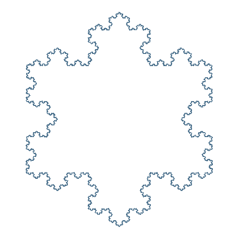
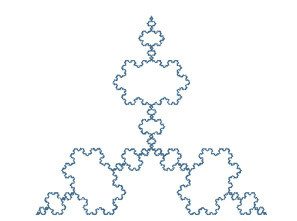
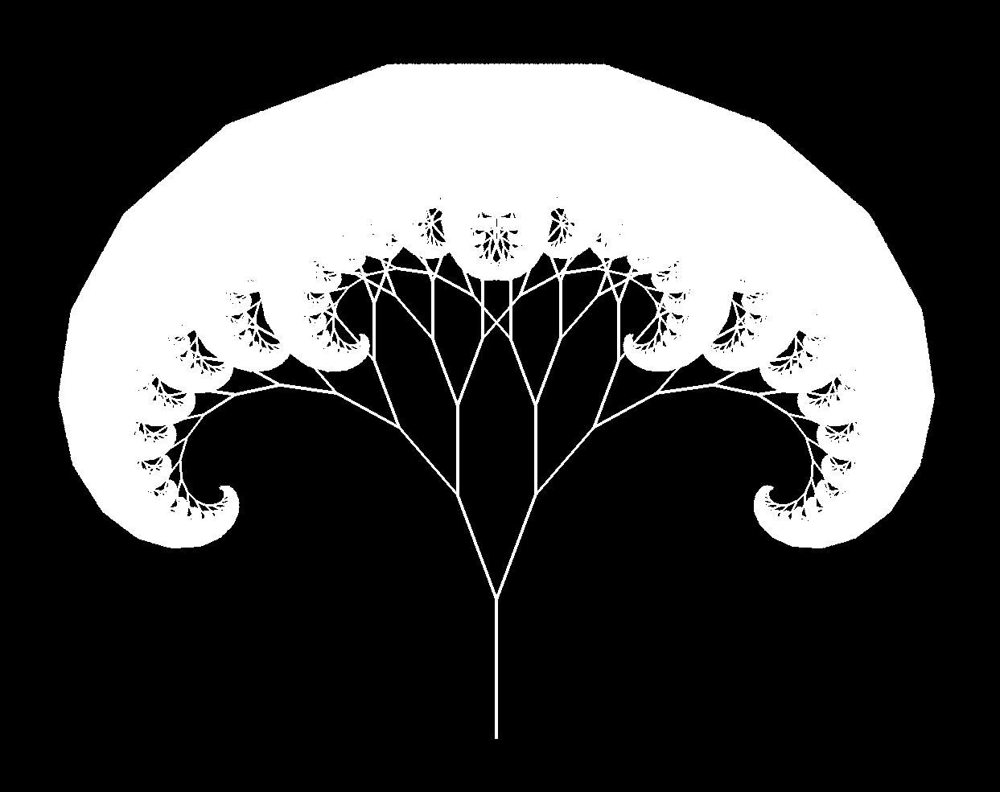
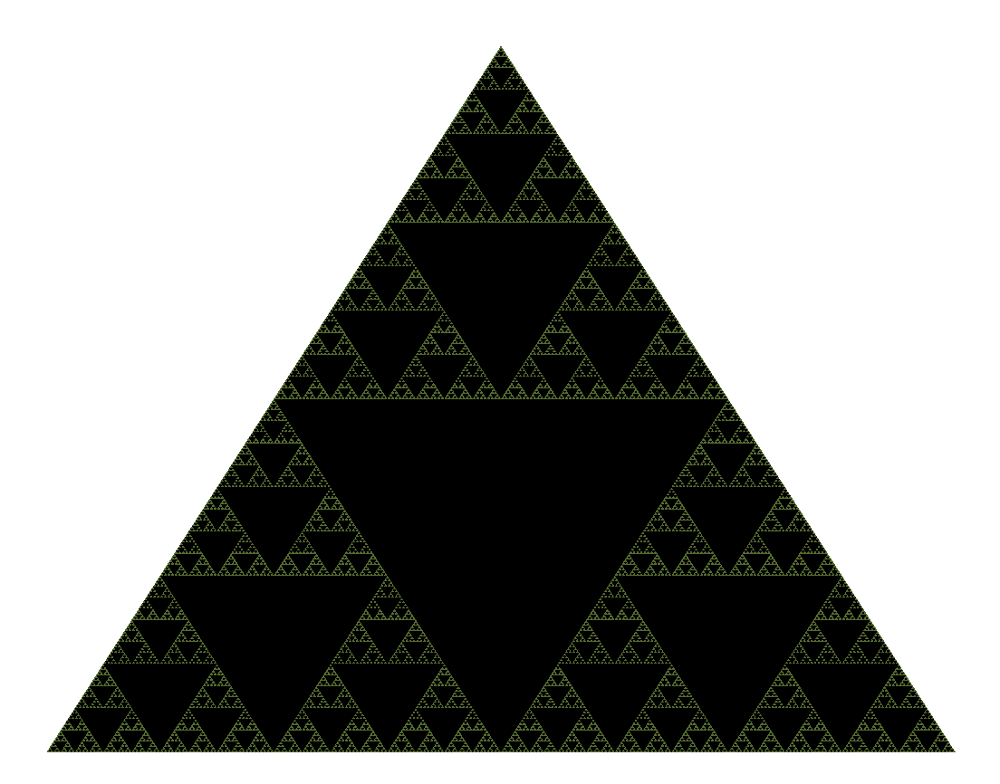
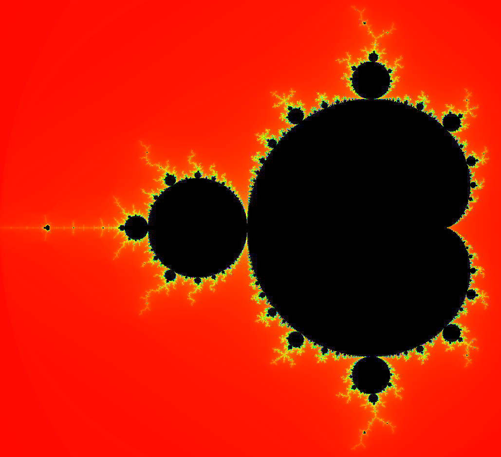

# Bachelor-Thesis

This thesis elaborates on the application of parallel programming to generate fractals. Fractals, due to their recursive nature, present a computational challenge for higher iterations, making them ideal candidates for parallel processing. Using NVIDIA's CUDA platform with cooperative groups, calculations are significantly accelerated compared to traditional sequential methods. The OpenGL library is used to visualize fractals, and CUDA-OpenGL interoperability is used to allow GPU-accelerated calculations to be rendered directly in OpenGL without the need to transfer data to CPU.

Check each submodules on this repository too see in detail the implementation of the each fractal. 

## Koch Snowflake

   

   

## Fractal Tree

   

## Sierpniski Triangle

   

## Mandelbrot Set

   

